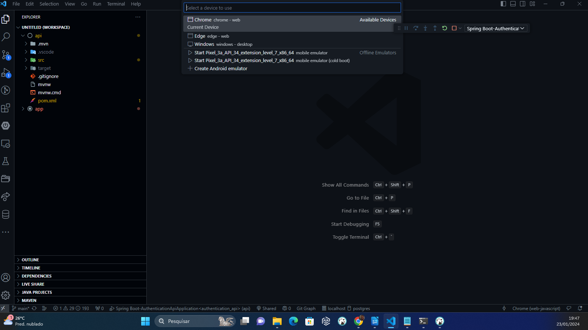
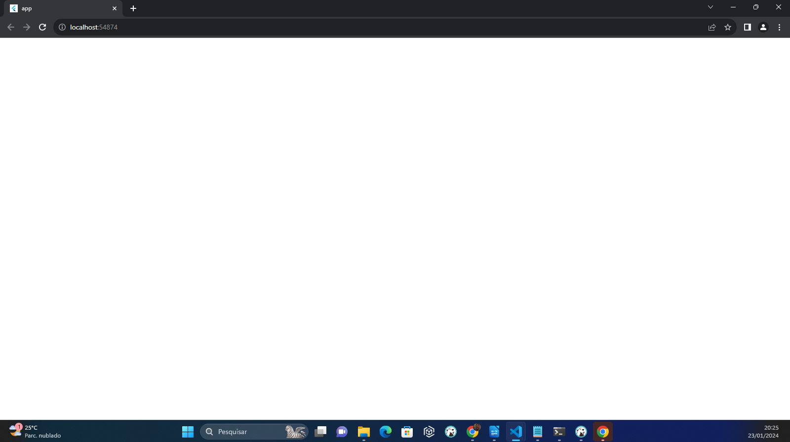
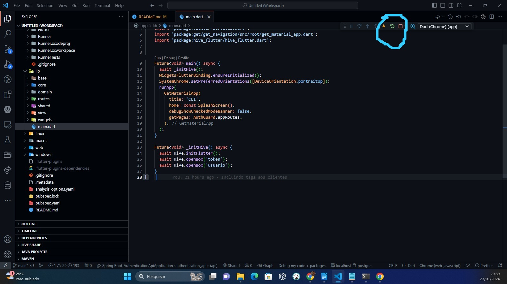

<h2>Sistema de Gerenciamento Clientes</h2>

<h3> Requisitos para rodar o projeto</h3>

<li><b>Flutter SDK <= 3.3.10:</b> Devido algumas bibliotecas utilizadas no projeto não funciona em todas as versões "Na minha máquina estou usando 3.3.10".
<li><b>Java JDK</b> A Api está feita em Java com SpringBoot Framework então há a necessidade de ter o JAVA JDK instalado Download disponnivel em => https://www.oracle.com/br/java/technologies/downloads/#java17 

<h3> Rodando API</h3>

   Na pasta api/src/java executar a classe AuthenticationApiApplication.java como está mostrando no imagem abaixo:

    

<h3> Conectando ao Banco Servidor rodando na AWS</h3>

   Para conectar ao banco de dados pode ser utilizado qualquer programa que abra o Postgres, no exemplo abaixo estou usando o próprio VsCode com a extensão MySQL:

    

<h3> Dados do servidor</h3>

Host: 54.207.164.209

Username: postgres

Database: postgres

Port: 5433

Password: j8s4684298ds74

<h3> Perfil Administrativo</h3>

    Ao realizar um novo cadastro no Sistema o novo usuário ficará sem perfil vinculado, pode se acessar o sistema com perfil de admin e conceder acesso ao sistema como está mostrando abaixo, ou continuar com perfil de admin e executar o CRUD. 

    Obs: Nos dois perfis o Crud está disponível, o perfil admin contém uma funcionalidade a mais de vincular perfil

    Perfil criado para processo seletivo: Cad. Cliente

     Usuario Admin: admin

     Senha: admin

    
    

<h3>Iniciando Aplicativo</h3>

     Devido algumas configurações do projeto, no momento so está rodando na Web então deve ser selecionado no Vscode a plataforma Web conforme está na Imagem abaixo:

    

    Para configuração do projeto está sendo utilizado o Hive para gerenciar e armanezar token, e acesso de funcionalidades do sistema por perfil de acesso. O hive_flutter é um pacote do Flutter que fornece uma solução de armazenamento de dados rápida e fácil de usar baseada no banco de dados Hive. Ele é útil quando você precisa armazenar dados de forma persistente e acessa-los rapidamente em seu aplicativo Flutter. Por esse motivo o inicialização do sistema está não está carregando de forma automática por enquanto, sendo necessário fazer Restart no VsCode clicando no botão de restart conforme mostra a imagem abaixo:

div align="center" style="display: flex; justify-content: space-around;">
    
    

